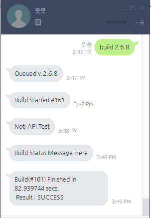
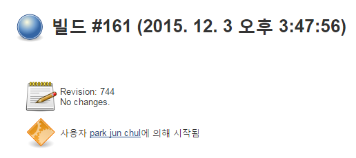

jenkins-line-remote
====
<br>
<br>
<br>
라인 메신저를 이용한 젠킨스 원격 빌드 환경 구성하기.

Noti API
----
빌드가 시작되면 빌드 스크립트가 __Noti API__를 통해서 빌드를 요청한 라인 계정에 메세지를 보낼 수 있습니다.<br>
이 API를 이용하면 빌드 성공, 실패 여부 이외에 부가 데이터를 빌드를 요청한 사용자에게 알려줄 수 있습니다.<br>
주로 빌드가 실패한 경우의 알림이나, 오래 걸리는 빌드인 경우, 중간중간의 진행상황을 보고하기 위해서 사용합니다.
```
POST /msg/JOB_NAME/BUILD_NUMBER HTTP/1.1

Place Message To Send Here
```

Configure
----
```rb
jenkins_host = "127.0.0.1"
jenkins_user = "pjc"
jenkins_password = "password"

line_user = "pjc0247@pmnxismail.com"
line_password = "djspada"
```

Usage
----

라마 플러그인으로 이용하기
----
한개의 라인 계정에 __jenkins-line-remote__뿐만 아니라 다른 기능도 넣고자 할 때 사용합니다.
* ㅎㅇ

Standalone 프로그램으로 이용하기
----
단순히 __jenkins-line-remote__만을 이용하고자 할 때 사용합니다.
```
jenkins_line CONFIG_PATH
```